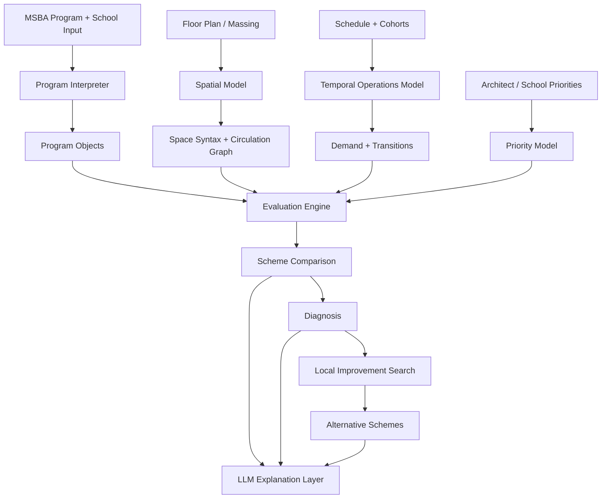

# School Program Intelligence

> **Working title** — a spatial programming and scheme-evaluation tool for K–12 school design.

School Program Intelligence is a computational design tool intended to help architects evaluate and refine school programming during early and mid-stage design. The project focuses on the gap between **how architects represent school programs** and **how schools actually operate space over time**.

Architectural programming is usually expressed through room lists, areas, capacities, adjacency matrices, and diagrams. Schools, however, use space dynamically: classrooms change activity throughout the day; commons and corridors can support informal learning; support spaces serve multiple cohorts; room assignments interact with timetables; and seemingly small spatial changes can strongly affect convenience, supervision, circulation, and flexibility.

The goal of this project is to make the school educational program **computable**.

Instead of treating a school program as a static list of rooms, the system models it as:

```text
SPACE × ACTIVITY × PEOPLE × TIME × RULES
```

The tool then uses this model to evaluate competing design schemes, explain their strengths and weaknesses, identify programmatic and spatial problems, propose local improvements, and eventually search for better-performing alternatives under user-defined priorities.

---

## 1. Project Goal

The project is intended primarily for **architects during internal programming and design development**, while also supporting communication with school representatives, administrators, teachers, and other stakeholders.

It is aimed at **new school projects and renovations**, from elementary through high school.

A typical use case is not:

> “Generate a school from nothing.”

Instead, it is closer to:

> “The building is 60–80% defined. Major circulation, cores, entrances, and floor plates are mostly fixed. Programs can still move, adjacencies can still improve, learning commons can shift, doors can change, breakout spaces can grow or shrink, and some local geometry can still be adjusted. Which scheme works best, why, and how can we improve it?”

The system should ultimately help architects make statements such as:

> **Scheme D performs better than Scheme B because it reduces daily student travel, improves Grade 4 access to shared learning space, avoids a lunch-period circulation bottleneck, and satisfies more high-priority educational adjacencies, while using approximately the same area.**

The key product is therefore not simply a score.

It is **reasoned comparison**.

---

## 2. Core Problem

Architects and schools often describe the same building in different languages.

### Architectural programming language

- room counts
- net and gross area
- capacities
- departments
- adjacency matrices
- room data sheets
- bubble diagrams
- floor plans
- massing

### School operational language

- cohorts
- class schedules
- teaching models
- transitions
- supervision
- shared rooms
- small-group learning
- informal learning
- teacher planning
- arrival and dismissal
- lunch periods
- activity-specific requirements

The project bridges these representations.

```text
SCHOOL LANGUAGE
Who?
Doing what?
When?
With whom?
Under what rules?

        ↓

COMPUTABLE EDUCATIONAL PROGRAM
Activity × Space × People × Time × Rules

        ↓

ARCHITECTURAL LANGUAGE
How much space?
What type?
Where?
Connected to what?
How well does this scheme support the school?
```

---

## 3. Why MSBA Is a Core Foundation

The Massachusetts School Building Authority (MSBA) provides a strong foundation for the project because its educational planning process already asks schools and design teams for much of the information required by the system.

MSBA educational programming includes topics such as:

- school scheduling methodology
- educational delivery structure
- teacher planning arrangements
- preferred educational adjacencies
- reasons behind adjacency preferences
- activities occurring outside general classrooms
- use and supervision of breakout spaces
- typical daily and weekly student experience
- spatial relationships between educational functions
- space summaries and area expectations

The opportunity is not to replace these requirements.

The opportunity is to **turn them into an executable model that can be tested against a floor plan**.

```text
MSBA Educational Program
+ Space Summary
+ Schedule
+ Adjacency Expectations
+ School Priorities
+ Teacher Input

        ↓

COMPUTABLE PROGRAM MODEL

        ↓

Scheme A / Scheme B / Scheme C / Scheme D

        ↓

Measured + Visualized + Explained Comparison
```

MSBA is therefore treated as a **baseline rules and programming layer**, while the proposed tool adds dynamic spatial and temporal analysis on top of it.

---

## 4. Design Stage Assumption

The project is most useful when the school design is **partially fixed but still adjustable**.

### Mostly fixed

- site organization
- floor plates
- building envelope
- major entrances
- primary stairs and elevators
- main circulation spines
- structural constraints
- major program blocks

### Still adjustable

- departmental locations
- grade neighborhoods
- classroom assignments
- support spaces
- learning commons
- learning corners
- breakout spaces
- office locations
- doors and openings
- local corridor connections
- room sharing
- program area within a limited range

This makes the project a constrained design problem rather than an unconstrained generative-design problem.

The system should favor **small, plausible, architecturally useful changes** before suggesting radical redesign.

---

## 5. Core Concept: Fixed Spatial Field + Movable Program

A useful way to model the project is as two layers moving at different speeds.

### Layer A — Spatial Field

The building defines a relatively stable spatial structure:

- visibility
- accessibility
- centrality
- depth
- connectivity
- route distance
- circulation capacity
- vertical transitions
- entrance relationships

### Layer B — Program Objects

The educational program remains relatively fluid:

- Grade 1
- Grade 2
- science
- art
- music
- SPED
- administration
- counseling
- library/media center
- teacher planning
- dining
- learning commons
- learning corners
- breakout spaces

The central design question becomes:

> **Which program belongs where within the available spatial field?**

---

## 6. Program as Computational Bubble Diagrams

Bubble diagrams should not be treated only as graphics.

Each bubble can become a **computational program object** with requirements, preferences, and temporal behavior.

Example:

```yaml
program: Grade 4 Learning Commons
area:
  target: 1200 sf
  range: 1000-1400 sf
capacity:
  target: 50
spatial_preferences:
  integration: high
  visibility: high
  privacy: low
  proximity:
    Grade 4 Classrooms: very_high
    Library: medium
    Dining: low
operation:
  informal_use: high
  scheduled_use: medium
  supervision_required: true
  shared_use: true
```

A counseling space could have a very different target profile:

```yaml
program: Counseling
spatial_preferences:
  integration: medium
  visibility: low
  privacy: very_high
  proximity:
    Main Office: high
    Student Areas: high
    Main Entrance: medium
```

The system therefore evaluates **program-location fit**, not merely whether a program physically fits inside a region.

---

## 7. System Architecture

The proposed system contains several interacting analytical layers.



The core principle is:

> **The LLM should interpret and explain. Deterministic or explicit analytical models should measure.**

---

# 8. Main Engines

## 8.1 Program / Compliance Engine

Questions:

- Is every required program present?
- Is the area sufficient?
- Is capacity sufficient?
- Are required support spaces present?
- Are program relationships consistent with MSBA expectations?
- Are local educational requirements represented?

Example outputs:

```text
Grade 3 classrooms required: 6
Grade 3 classrooms provided: 5
Status: Missing 1 classroom
```

or:

```text
Learning Commons target area: 1,200 sf
Scheme C provided area: 920 sf
Status: Below preferred range
```

---

## 8.2 Spatial Relationship Engine

This engine measures whether related activities are appropriately located.

Instead of treating adjacency as binary:

```text
Adjacent / Not Adjacent
```

the system should treat relationships as weighted and continuous.

For programs `i` and `j`:

```math
AdjacencyPenalty = \sum_{i,j} w_{ij} f(d_{ij})
```

Where:

- `w_ij` = importance of the relationship
- `d_ij` = actual route or topological distance
- `f()` = penalty curve

This allows a distinction between:

- must touch
- must be nearby
- should be nearby
- weak preference
- neutral
- should be separated

Example:

```text
Grade 2 ↔ SPED Support
Requested importance: VERY HIGH
Actual walking distance: 185 ft
Preferred threshold: < 100 ft
Result: Poor relationship fit
```

---

## 8.3 Temporal Operations Engine

This engine represents the school as a system that changes over time.

The basic unit is:

```text
space + activity + people + time
```

For every time interval the system can estimate:

- room occupancy
- activity type
- shared-space demand
- schedule conflicts
- student transitions
- teacher transitions
- corridor load
- vertical movement
- unused capacity

Example:

```text
10:00–10:50

Classroom 204
Activity: Grade 6 English
Students: 24
Capacity: 28

Learning Corner 2
Activity: Small-group instruction
Students: 6
Capacity: 8

Commons A
Activity: Independent project work
Students: 18
Capacity: 35
```

This is more useful than a static room utilization percentage because it exposes **when** and **why** a spatial condition works or fails.

---

## 8.4 Optimization Engine

After problems are identified, the system should search for better arrangements.

Possible operations include:

- swap program A and program B
- move a program to another candidate zone
- reassign shared rooms
- move a learning commons
- change a door
- add a connection
- adjust program size within allowable limits
- split a program
- merge compatible uses
- modify room scheduling

The first optimization layer should operate primarily on **program allocation and small local spatial changes**, not full architectural geometry generation.

Constraint programming, assignment optimization, and multi-objective search are likely appropriate foundations.

---

# 9. Role of Space Syntax

Space Syntax should be a major analytical layer, but **not the single definition of design quality**.

Its role is to describe the underlying configurational properties of the partially fixed building.

Useful measures may include:

- connectivity
- visual connectivity
- visual integration
- topological depth
- metric depth
- choice / betweenness
- accessibility
- visibility relationships
- relationship to primary circulation

The important conceptual distinction is:

> **Space Syntax estimates spatial potential. The school schedule describes operational demand.**

These two are related but not equivalent.

A highly integrated corridor may see limited use by a particular cohort if the school schedule rarely sends students through it.

A relatively segregated corridor may experience intense peak traffic if it connects classrooms to dining during lunch transition.

Therefore:

```text
Spatial Potential ≠ Operational Demand
```

The project becomes more powerful when it compares the two.

---

## 9.1 Spatial Fingerprints

Each candidate location can be represented as a spatial feature vector.

```text
Location X
[
  visual_integration,
  connectivity,
  depth_from_entry,
  depth_from_grade_cluster,
  route_centrality,
  visibility,
  circulation_exposure,
  ...
]
```

Each program also has a desired spatial profile.

```text
Program Y
[
  desired_integration,
  desired_visibility,
  desired_privacy,
  desired_accessibility,
  desired_proximity,
  ...
]
```

Then:

```math
SpatialFit(program, location)
= similarity(requirement_profile, spatial_profile)
```

This allows the system to evaluate whether a program is placed in an appropriate type of space.

---

## 9.2 Why Visibility Graph Analysis Is Especially Relevant

Visibility Graph Analysis (VGA) may be particularly valuable for school design because many educational and supervision relationships are visual rather than purely metric.

Questions include:

- Can a teacher visually supervise a learning corner?
- Does a commons feel part of a grade neighborhood?
- Is an informal learning area visible from everyday circulation?
- Can students orient themselves easily?
- Is a support area exposed or protected appropriately?

For example, two learning commons may have identical areas and similar walking distances, but one may have substantially better visibility from adjacent classrooms.

The tool should be able to recognize that distinction.

---

# 10. Operational Graph

Space Syntax alone is not sufficient.

The project should also construct an explicit **circulation / operational graph** from the floor plan.

### Nodes

- rooms
- doors
- corridor junctions
- stairs
- elevators
- entrances
- learning spaces
- shared spaces

### Edges

- walkable paths
- vertical connections
- doors
- corridor segments

Each edge may contain:

```text
length
width
capacity
travel_time
floor_change
access_rules
```

This graph answers questions such as:

- How far does Grade 5 travel to art?
- Which stair handles the most transitions?
- Which corridor experiences the greatest peak demand?
- Which program arrangement minimizes student movement?

---

## 10.1 Scheduled Flow

If the timetable states that a cohort moves from program `i` to program `j`, the system can assign that demand to the circulation network.

```math
Flow_e(t) = \sum_{i,j} Students_{ij}(t) \cdot Route_{ij,e}
```

This produces a time-dependent circulation model.

Example visualization:

```text
11:30 AM

Main Corridor A      ███████████████  220 students
East Corridor        █████             72 students
Library Connector    ██                29 students
Upper Hall           █                  9 students
```

This captures much of the useful information often associated with pedestrian simulation while remaining transparent and computationally lightweight.

---

# 11. Why Agent-Based Simulation Is Not the Core

A full agent-based model is not necessary for most scheduled school behavior.

If the timetable already specifies:

```text
Grade 6 Science
10:00–10:50
Room 203
```

there is very little behavioral uncertainty.

The students simply need to travel from the previous activity to Science.

For these situations, a route and scheduled-flow model is more explainable and efficient than simulating hundreds of autonomous agents.

### ABM becomes useful when destination choice is uncertain.

Examples:

- students selecting between several learning corners
- students choosing where to spend project time
- informal occupation of commons
- spontaneous social gathering
- use of flexible corridors and breakout spaces

A lightweight behavioral model could later estimate:

```math
P(space) = f(
  distance,
  visibility,
  integration,
  crowding,
  furniture,
  activity,
  social preference,
  teacher rules
)
```

Therefore:

> **ABM should be an optional behavioral microscope, not the primary evaluation engine.**

---

# 12. Performance Framework

The project should avoid collapsing architectural quality into a mysterious single AI score.

Instead, performance should be evaluated across explicit dimensions.

---

## 12.1 Size / Capacity Fit

Questions:

- Is the room large enough?
- Is capacity appropriate?
- Is space consistently oversized?
- Does peak demand exceed capacity?

Possible metric:

```math
CapacityFit(s,t) = Demand(s,t) / Capacity(s)
```

The model should identify both shortage and excessive under-use.

---

## 12.2 Relationship Fit

Questions:

- Are related programs close enough?
- Are frequently paired activities connected efficiently?
- Are programs that should be separated too close?

Possible factors:

- route distance
- topological distance
- floor changes
- visual relationship
- direct adjacency
- shared circulation

---

## 12.3 Operational Efficiency

Questions:

- How much total travel occurs per day?
- How many floor changes occur?
- Are transitions realistic within the bell schedule?
- Where are peak bottlenecks?

Potential metrics:

```text
total student travel distance
mean transition distance
95th percentile transition distance
vertical transitions per student
peak corridor flow
peak stair flow
```

---

## 12.4 Utilization

Questions:

- How often is a space active?
- At what capacity?
- Is a shared space actually shareable?
- Are conflicts occurring?

Example timeline:

```text
Classroom 101

08:00 ██████████
09:00 ██████████
10:00 ████████░░
11:00 ░░░░░░░░░░
12:00 ░░░░░░░░░░
13:00 █████████░
14:00 ██████████
```

---

## 12.5 Shared-Space Leverage

A particularly important school-specific metric may be:

> **How many educational needs does this shared space satisfy without producing schedule conflicts or operational friction?**

This is especially relevant for:

- learning commons
- breakout rooms
- multipurpose rooms
- informal learning spaces
- shared project rooms
- dining / assembly hybrids

---

## 12.6 Convenience / Operational Friction

Convenience can be represented as a composite of explicit penalties.

```math
Friction =
  w1 × walking
+ w2 × floor_changes
+ w3 × congestion
+ w4 × schedule_conflict
+ w5 × supervision_difficulty
+ w6 × access_conflict
```

The weights should remain visible and editable.

---

## 12.7 Spatial Potential Fit

Questions:

- Is an informal learning space visible enough?
- Is a commons integrated enough?
- Is counseling appropriately protected?
- Does the spatial configuration support the intended educational role?

This layer uses Space Syntax and other spatial features rather than schedule alone.

---

# 13. Flexible Definition of “Best”

The project should support different school priorities.

There is no universal best school plan.

One district may prioritize:

- small learning neighborhoods
- minimal student travel
- high visibility
- flexible commons

Another may prioritize:

- compact area
- straightforward supervision
- community access
- low construction cost

The user may describe priorities in natural language:

> “We care most about maintaining small grade neighborhoods and minimizing student travel. We are willing to accept slightly more area if it gives us better shared learning spaces.”

The LLM can translate that statement into a visible priority model:

```text
Student travel            HIGH
Neighborhood cohesion     HIGH
Shared-space performance  HIGH
Area efficiency           MEDIUM
Construction efficiency   MEDIUM
Community access          LOW
```

The user should be able to inspect and modify these weights.

The LLM does **not** directly decide which scheme is best.

Instead:

```text
LLM interprets priorities
        ↓
Analytical engines measure performance
        ↓
Optimization compares alternatives
        ↓
LLM explains the results
```

---

# 14. Scheme Comparison

The primary output should support architectural comparison.

Example:

| Metric | Scheme A | Scheme B | Scheme C | Scheme D |
|---|---:|---:|---:|---:|
| Program fit | 98 | 100 | 97 | 100 |
| Capacity fit | 91 | 86 | 94 | 96 |
| Adjacency fit | 76 | 82 | 91 | 94 |
| Daily student travel | 12.8 mi | 15.1 mi | 10.4 mi | **8.7 mi** |
| Peak circulation stress | High | Medium | Medium | **Low** |
| Space utilization | 74% | 81% | 79% | **83%** |
| Shared-space leverage | Medium | Low | High | **High** |

Instead of returning only:

```text
Scheme D = 91
```

the tool should explain:

> Scheme D currently performs best under the selected priorities. Its largest advantage over Scheme C is reduced Grade 3–5 travel and better placement of the shared learning commons along everyday circulation. Scheme C performs similarly in area efficiency but creates a higher lunch-transition load on the east stair.

The explanation should always remain traceable to explicit metrics.

---

# 15. Diagnosis Before Generation

The tool should reveal problems before attempting to solve them.

Example diagnosis:

```text
ISSUE 01
Grade 5 → Art travel distance is 42% above project target.

ISSUE 02
The Grade 4 Learning Commons has sufficient area but low visibility from its primary classrooms.

ISSUE 03
Two support programs require the same breakout room Tuesday 10:00–10:45.

ISSUE 04
The east stair receives 61% of all lunch-period vertical movement.
```

Only after diagnosis should the system suggest interventions.

---

# 16. Local Improvement Search

The first generation mode should prioritize **minimal intervention**.

Example:

```text
Current Scheme C
        ↓

C+1
Swap Art and Music
→ Grade 5 travel -11%
→ Grade 6 travel +2%

C+2
Move learning commons one bay west
→ Visibility +27%
→ Grade-cluster distance -9%

C+3
Add corridor connection
→ Peak east-stair load -18%
→ Added construction impact: moderate
```

This is likely more useful to an architect than immediately generating an unrelated new building.

A later stage may produce broader alternative layouts.

---

# 17. Interaction Model

A possible interface workflow:

### 1. Import

Architect imports:

- floor plan
- simplified massing
- room boundaries
- circulation
- MSBA space summary
- school schedule

### 2. Define Program

Programs appear as editable bubble objects.

### 3. Add School Input

School representatives or teachers describe:

- desired adjacencies
- typical day
- supervision needs
- shared-space use
- operational concerns
- project priorities

### 4. Compute Spatial Field

The system calculates:

- network distance
- integration
- visibility
- depth
- circulation structure

### 5. Place / Move Programs

The architect drags or reassigns program objects.

### 6. Live Feedback

Example:

```text
GRADE 4 COMMONS

Spatial Fit        71 → 89
Grade 4 travel     -14%
Classroom visibility +32%
Main circulation exposure +18%
Distance to dining +4%
```

### 7. Ask Why

User:

> Why did this improve?

System:

> The new location is closer to the four Grade 4 classrooms and is visible from their primary circulation path. It is slightly farther from dining, but dining proximity has a lower priority in the current project criteria.

### 8. Compare Schemes

A / B / C / D are evaluated consistently.

### 9. Improve

The system proposes local modifications and alternative arrangements.

---

# 18. Data Model

A simplified internal schema may contain the following objects.

## Space

```yaml
id:
geometry:
area:
capacity:
floor:
program_type:
doors:
adjacencies:
visibility:
spatial_metrics:
  integration:
  connectivity:
  depth:
  choice:
```

## Program

```yaml
id:
name:
category:
area_target:
area_range:
capacity:
activities:
spatial_preferences:
adjacency_preferences:
privacy:
supervision:
shared_use:
```

## Activity

```yaml
id:
name:
cohort:
size:
duration:
space_requirements:
equipment_requirements:
privacy_requirement:
supervision_requirement:
```

## Schedule Event

```yaml
time_start:
time_end:
activity:
cohort:
assigned_space:
previous_space:
next_space:
```

## Relationship

```yaml
source_program:
target_program:
importance:
preferred_distance:
relationship_type:
  adjacent
  nearby
  visible
  separated
```

## Priority

```yaml
metric:
weight:
source:
  architect
  school
  MSBA
  project_default
```

---

# 19. Suggested MVP

The first prototype should deliberately avoid excessive complexity.

### Input

- one simplified 2D school floor plan
- approximately 20–40 program zones
- one representative school-day schedule
- student cohort sizes
- MSBA-inspired room targets
- program adjacency preferences
- simple user-defined project priorities

### Geometry

- room polygons
- doors
- corridor centerlines or navigation mesh
- stairs
- entrances

### Analysis

- area / capacity fit
- route distance
- weighted adjacency
- scheduled movement
- basic corridor load
- visual connectivity or VGA-derived values
- simple utilization timeline

### Outputs

- colored floor-plan evaluation
- temporal scrubber
- program bubble view
- A/B/C/D comparison
- problem diagnosis
- plain-language explanations
- one or more local improvement suggestions

### Explicitly excluded from MVP

- full pedestrian ABM
- high-fidelity BIM
- detailed code compliance
- structural optimization
- MEP analysis
- complete geometry generation
- automatic construction cost estimation

---

# 20. Development Roadmap

## Phase 1 — Executable Program

Build the data model.

```text
Program
+ Schedule
+ Relationships
+ Floor Plan
```

Goal:

> Can the tool determine whether a scheme supports the intended educational program?

---

## Phase 2 — Scheme Evaluation

Add:

- spatial graph
- Space Syntax metrics
- temporal movement
- utilization
- comparison dashboard

Goal:

> Can the system convincingly explain why Scheme A performs differently from Scheme B?

---

## Phase 3 — Diagnosis

Add rule-based and metric-based problem detection.

Goal:

> Can the system identify the parts of a design that cause poor performance?

---

## Phase 4 — Local Optimization

Add constrained program relocation and swapping.

Goal:

> Can the system improve an existing scheme without destroying the architect's design intent?

---

## Phase 5 — Alternative Generation

Add broader multi-objective search.

Goal:

> Can the system produce several meaningfully different, defensible program configurations?

---

## Phase 6 — Behavioral Layer

Add light agent-based simulation for informal and unscheduled behavior.

Goal:

> Can the system estimate how flexible and informal learning spaces may actually be occupied?

---

## Phase 7 — Post-Occupancy Learning

Compare predicted use against observed use from completed schools.

Possible inputs:

- occupancy observations
- schedule records
- sensor data
- teacher feedback
- student feedback
- post-occupancy evaluation

Goal:

```text
Predicted Performance
        ↓
Built School
        ↓
Observed Performance
        ↓
Model Calibration
        ↓
Better Future Programming
```

---

# 21. Research Questions

The project currently revolves around several research questions:

1. **Can an educational program be represented as a dynamic computational model rather than a static room list?**
2. **Can Space Syntax and operational schedule data be combined to distinguish spatial potential from actual demand?**
3. **Can architects compare partially developed school schemes using explicit, interpretable performance metrics?**
4. **Can a system diagnose why a program arrangement performs poorly rather than only assigning a score?**
5. **Can constrained computational search improve program placement while preserving most of the existing architectural design?**
6. **Can natural-language school priorities be translated into transparent evaluation weights without delegating design judgment entirely to an LLM?**
7. **Can informal spaces such as corridors, learning commons, and breakout areas be modeled as active educational program rather than residual circulation?**

---

# 22. Design Principles

### Explainability over black-box scoring

Every recommendation should be traceable to measurable criteria.

### Diagnosis before generation

The system should first explain what is wrong before trying to redesign it.

### Small interventions before radical alternatives

Architectural intent should be preserved whenever possible.

### School operation over abstract geometry

Spatial metrics matter only insofar as they help explain educational performance.

### Dynamic program over static room lists

Program is understood as activity over time.

### Informal space is real program

Corridors, commons, learning corners, thresholds, and breakout areas can have explicit educational roles.

### Human priorities remain visible

“Best” is project-specific and should depend on editable criteria rather than hidden model preferences.

### LLM as interface, not authority

The LLM translates, explains, and helps negotiate criteria. It should not fabricate analytical results.

---

# 23. Potential Technical Direction

This is intentionally provisional.

### Geometry / architectural integration

Possible environments:

- Rhino / Grasshopper
- Revit / Dynamo
- web-based SVG or vector-plan editor
- IFC / BIM import later

### Spatial analysis

- custom graph model
- NetworkX or equivalent
- depthmapX / Space Syntax methodology
- custom visibility graph

### Scheduling / optimization

- Google OR-Tools CP-SAT
- mixed-integer optimization
- graph assignment
- multi-objective optimization

### Backend

- Python

### Interface

- web application
- optional Rhino / Grasshopper bridge

### LLM layer

Potential tasks:

- extracting priorities from school interviews
- translating narrative educational programs into structured requirements
- explaining scheme comparisons
- summarizing conflicts
- proposing interpretable design moves

The LLM should not calculate core performance values when explicit algorithms are available.

---

# 24. Possible Repository Structure

```text
school-program-intelligence/
│
├── README.md
├── docs/
│   ├── research/
│   ├── msba/
│   ├── precedents/
│   └── methodology/
│
├── data/
│   ├── programs/
│   ├── schedules/
│   ├── plans/
│   └── examples/
│
├── src/
│   ├── program/
│   │   ├── schema.py
│   │   ├── parser.py
│   │   └── msba_rules.py
│   │
│   ├── spatial/
│   │   ├── graph.py
│   │   ├── visibility.py
│   │   ├── space_syntax.py
│   │   └── routing.py
│   │
│   ├── temporal/
│   │   ├── schedule.py
│   │   ├── transitions.py
│   │   └── utilization.py
│   │
│   ├── evaluation/
│   │   ├── capacity.py
│   │   ├── adjacency.py
│   │   ├── circulation.py
│   │   ├── spatial_fit.py
│   │   └── scoring.py
│   │
│   ├── optimization/
│   │   ├── constraints.py
│   │   ├── assignment.py
│   │   └── alternatives.py
│   │
│   └── llm/
│       ├── interpreter.py
│       └── explanations.py
│
├── app/
│   ├── plan_view/
│   ├── bubble_view/
│   ├── timeline/
│   └── comparison/
│
└── tests/
```

---

# 25. Key Precedent Categories

The project draws from several existing domains but sits between them.

### Architectural programming

Examples such as dRofus demonstrate structured room, area, equipment, and requirement management.

### Computational planning / bubble diagrams

Tools such as Hypar and Adjacency Lab demonstrate interactive program placement and spatial relationship interfaces.

### School educational planning

MSBA provides formal space summaries, educational programming requirements, breakout-space studies, and post-occupancy evaluation frameworks.

### Space Syntax

Space Syntax provides methods for describing visibility, accessibility, integration, connectivity, and configurational potential.

### Scheduling optimization

Constraint programming and operations research provide models for room assignment, timetable conflicts, capacity mismatch, and travel minimization.

### Pedestrian simulation

Pedestrian and agent-based tools demonstrate how movement can be modeled, but the project uses these selectively rather than making them the analytical core.

### Digital twins / post-occupancy evaluation

These provide a possible future path for comparing predicted school performance with real occupancy and operational data.

---

# 26. Initial Reference Set

These references are starting points rather than an exhaustive literature review.

### MSBA

- [MSBA — Feasibility Study / Module 3](https://www.massschoolbuildings.org/building/feasibility)
- [MSBA — Educational Program Requirements](https://www.massschoolbuildings.org/sites/default/files/edit-contentfiles/Building_With_Us/Ed_Facilities_Planning/Educational_Program_Requirements_December2023.pdf)
- [MSBA — Break-out Spaces Study](https://www.massschoolbuildings.org/sites/default/files/edit-contentfiles/Building_With_Us/Ed_Facilities_Planning/Break-out_Spaces_Presentation.pdf)
- [MSBA — Post Occupancy Evaluation](https://www.massschoolbuildings.org/building/postoccupancy)

### Space Syntax

- [Space Syntax — Software / depthmapX](https://www.spacesyntax.net/software/)
- [Space Syntax Online — Spatial Form Analysis](https://www.spacesyntax.online/applying-space-syntax/building-methods/spatial-form-analysis/)

### Programming / Planning Tools

- [dRofus](https://www.drofus.com/)
- [Hypar](https://hypar.io/)
- [Adjacency Lab](https://adjacencylab.com/)

### Optimization

- [Google OR-Tools — Constraint Programming](https://developers.google.com/optimization/cp)

### Learning Space Research

- [University of Melbourne LEaRN — Churchie Project](https://sites.research.unimelb.edu.au/learn-network/projects/the-churchie-project)
- [EDUCAUSE — Learning Space Rating System](https://www.educause.edu/focus-areas-and-initiatives/teaching-and-learning-program/initiatives/learning-space-rating-system)

---

# 27. Current Thesis

The working thesis of the project is:

> **School programming should be evaluated as a temporal spatial system rather than a static collection of rooms. By combining educational schedules, MSBA programming requirements, program relationships, Space Syntax, circulation analysis, and user-defined priorities, architects can test how well partially developed design schemes support the actual operation of a school and receive transparent, actionable guidance for improving them.**

An even shorter version:

> **Make the educational program executable.**

---

# 28. Current Status

**Stage:** engines-first MVP in progress (Python core + CLI + synthetic toy school).

See [docs/methodology/PLAN.md](docs/methodology/PLAN.md) for the phased build plan.

---

## Development

```bash
python -m pip install -e ".[dev,web]"
spi evaluate --fixture toy_elementary --scheme A
spi compare --fixture toy_elementary
spi diagnose --fixture toy_elementary --scheme B
spi improve --fixture toy_elementary --scheme B
spi serve   # thin web UI (FastAPI)
pytest
```

Package lives under `src/school_program_intelligence/`. Example data: `data/examples/toy_elementary/`.

---

## License

MIT — see [LICENSE](LICENSE).

## Authors / Contributors

TBD.
